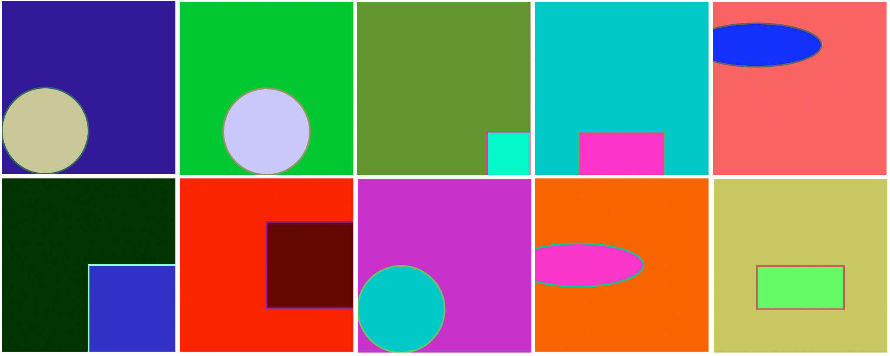

CFG that writes very simple p5.js code.

Example output:

```
function setup() { createCanvas(200, 200); background(50, 0, 150); fill(200, 200, 150); stroke(50, 100, 100); strokeWeight(2); ellipse(50, 150, 100, 100); noLoop(); }
```

Ten different example outputs, executed:

