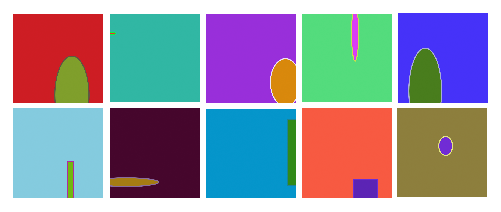

# CFG that writes very simple p5.js code.

## Example outputs:

```javascript
function setup() { createCanvas(255, 255); background(132, 203, 222); fill(113, 184, 15); stroke(178, 1, 166); strokeWeight(3); rect(152, 152, 18, 201); }
```
```javascript
function setup() { createCanvas(255, 255); background(48, 183, 164); fill(241, 11, 54); stroke(15, 250, 53); strokeWeight(3); ellipse(4, 58, 22, 8); }
```
```javascript
function setup() { createCanvas(255, 255); background(4, 149, 203); fill(49, 138, 24); stroke(30, 131, 147); strokeWeight(3); rect(230, 30, 71, 188); }
```

## Example outputs, executed:


